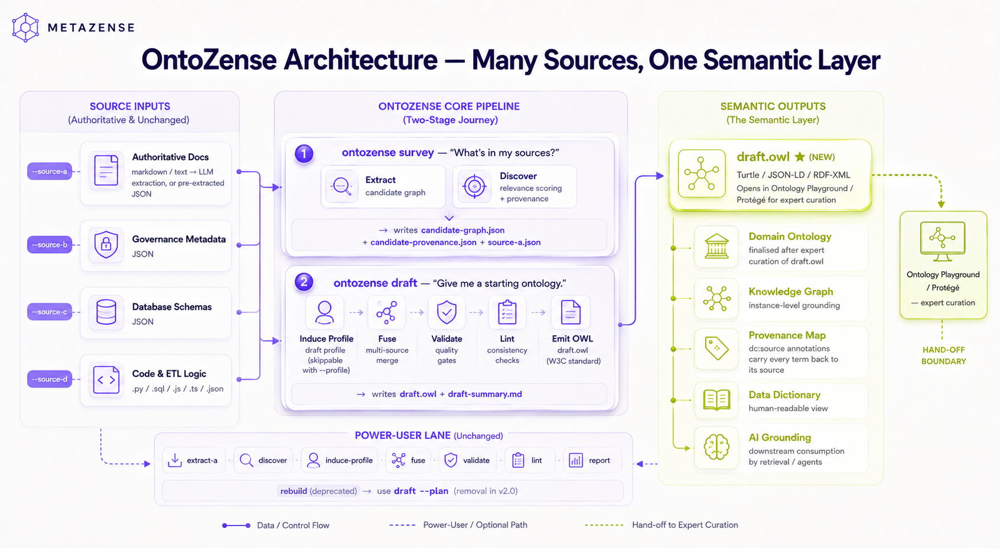

# Tycho

Build a **semantic layer** — a draft OWL ontology of your domain's entities, definitions, relationships, properties, and rules — from your existing documents, governance catalogs, database schemas, and code. Hand the draft to an expert in [Ontology Playground](https://github.com/hzmarrou/ontology-playground) or [Protégé](https://protege.stanford.edu) to finish the last 30%.

Tycho does the mechanical 60–70% of the work — extraction, fusion, validation, lint, anchoring every claim back to the source — so a domain expert doesn't start from a blank slate.

*(A "semantic layer" is what's sometimes called a domain ontology, a knowledge model, or a rich data dictionary. Same idea — a structured map of what concepts exist in your domain, how they relate, and what rules apply.)*



## The journey

```text
  ┌─────────────┐         ┌──────────────┐         ┌──────────────┐
  │   SOURCES   │   →     │   SURVEY     │   →     │    DRAFT     │   →    draft.owl
  │             │         │   (Tycho)    │         │   (Tycho)    │              │
  │ docs/*.md   │         │              │         │              │              ↓
  │ governance  │         │ extract +    │         │ induce +     │   ┌────────────────┐
  │   .json     │         │ merge into   │         │ fuse + check │   │  Ontology       │
  │ schemas/    │         │ candidate    │         │ + emit OWL   │   │  Playground     │
  │ code/       │         │ graph        │         │              │   │  (expert        │
  └─────────────┘         └──────────────┘         └──────────────┘   │   curation)     │
                                                                       └────────────────┘
                                                                              ↓
                                                                       Final ontology
```

Two commands take you to a draft you can hand off:

```bash
# Stage 1 — Survey: see what's in your sources
ontozense survey --source-a docs/*.md --source-b governance.json --domain-dir domains/mydomain

# Stage 2 — Draft: build the semantic layer and emit OWL
ontozense draft --domain-dir domains/mydomain --source-b governance.json --output domains/mydomain/draft.owl
```

Then open `draft.owl` in your curation tool of choice. Tycho's job ends there; the expert finishes.

## Vocabulary

| Term | Definition |
|---|---|
| **Semantic layer** *(canonical noun)* | Structured map of a domain's entities, definitions, relationships, properties, and rules. Tycho produces a draft. |
| **Draft ontology** / `draft.owl` | The handoff file. Standard OWL/Turtle. Open in Protégé, Ontology Playground, or any OWL editor. |
| **Domain** | The area being modeled (NPL, ESG, customer data, …). Each domain has its own `domains/<name>/` workspace. |
| **Profile** | A schema declaring allowed entity types, predicates, ID format. Either hand-authored or auto-**induced** by Tycho during Draft. |
| **Survey** | Stage 1 — extract from sources, merge into a candidate graph. |
| **Draft** | Stage 2 — turn the candidate graph into a constrained semantic layer; emit OWL. |
| `fused.json` | Tycho's internal working file. `draft.owl` is the human-facing output; `fused.json` carries provenance and confidence details that don't fit cleanly in OWL. |
| **Source A / B / C / D** | The four input kinds: A = authoritative documents, B = governance JSON, C = database schemas, D = production code. |

## The four-source pipeline

```
  Source A: documents (LLM)  ──┐
  Source B: governance (JSON)  ├─→  FUSION  ─→  VALIDATE  ─→  LINT  ─→  REPORT
  Source C: schemas (DB/AST)   │       │            │           │         │
  Source D: code (AST)         ─┘      │            │           │         │
                                       │            │           │         ↓
                                       │            │           │   Benchmark
                                       │            │           │   snapshot
                                       │            │           │   (JSON+MD)
                                       ↓            ↓           ↓
                                   QUERY  ←→  FILE-BACK  ←→  rich data dictionary
                                                              (Karpathy feedback loop)
```

*The diagram above shows the post-profile pipeline. For the
**discovery workflow** (Path 1) that produces a draft profile
from the same four sources via `discover` → `induce-profile` →
`rebuild`, see the Discovery bullet under
[How Tycho works](#how-tycho-works) below.*

Each source contributes only the fields it can defensibly produce.
Fusion combines them with per-field provenance, conflict resolution,
and (in profile mode) cross-source ID alignment so the same canonical
entity from N sources / M documents collapses to one element. Validate
checks the fused output against six structural rules borrowed from the
[OntoMetric](https://github.com/Inspiring-Ming/OntoMetric) methodology.
Lint catches contradictions, orphans, coverage gaps, and structural
holes via graph analysis. Report produces a benchmark snapshot for
run-vs-run comparison. Query + file-back lets experts review the
draft and commit corrections back into the knowledge base.

## How Tycho works

There are three ways to use the journey above, depending on what you bring to it.

**Unconstrained.** No profile. Source A's LLM extracts whatever concepts it finds; fusion merges by normalised name. Use this when you don't yet know the target shape and just want to see what's in your sources.

**Profile mode.** You hand Tycho a profile package (`schema.json` + sidecars) declaring allowed entity types, predicates, alias map, ID format, and canonical verbs. The LLM is constrained to that vocabulary; concepts get deterministic IDs; all four sources align on those IDs so consolidation is a `dict[id]` group-by. See `docs/PROFILE_SPEC.md` for the format and `docs/profile-examples/esg/` for a worked reference.

**Discovery.** No profile yet, but want one. `survey` builds a candidate graph from raw sources; `draft` auto-induces a profile from it (or accepts a hand-authored one) and emits the OWL. The induced profile is a *draft* — the curator reviews and edits it during hand-off.

All three paths end at the same place: a `draft.owl` you can open in an OWL editor.

### Sources C and D as seeders (v1.1)

As of v1.1, `--source-c` (`.sql` DDL files) and `--source-d` (`.py` files) are no
longer forward-compatible no-ops — they actively contribute first-class candidates
to the candidate graph that `survey` builds and `draft` consumes.

**What each source produces:**

- **Source C (SQL DDL):** tables → entity candidates, columns → attribute
  candidates, foreign-key constraints → relationship candidates, lookup/code tables
  (detected by naming heuristics or `force_vocabulary` override) → vocabulary
  candidates.
- **Source D (Python code):** classes, dataclasses, Pydantic models, and SQLAlchemy
  models → entity candidates; fields → attribute candidates; `Enum` subclasses →
  vocabulary candidates; validation functions → rule candidates; methods → behaviour
  candidates.

**Per-domain YAML config:** place a `source-c.yaml` or `source-d.yaml` file in the
domain workspace to tune which artifacts Tycho promotes or suppresses. Each file
supports `exclude_*` / `include_*` glob patterns, `force_vocabulary`, and
`force_entity` overrides. `exclude_*` patterns always suppress matching names;
`include_*` patterns rescue specific items from the default heuristic suppressions
(e.g. keep a `customer_audit` table that the `*_audit` default would have dropped)
but do not override `exclude_*`.

**Example invocation with all four sources:**

```bash
ontozense survey \
  --source-a domain/docs/ \
  --source-b domain/governance.json \
  --source-c domain/schemas/core.sql \
  --source-d domain/code/ \
  --domain-dir domain/
```

**The `audit` block:** `candidate-graph.json` now carries an `audit` array alongside
`concepts` and `relationships`. Each entry records a candidate that was filtered,
the reason (default suppression pattern or explicit YAML rule), and the source type
(`"C"` or `"D"`). Use it to understand what Tycho chose not to promote and why.

**Sources A and B are unchanged.** Every pipeline run that worked before v1.1
continues to work identically. Passing `--source-c` or `--source-d` is always
optional.

For full design details, suppression-pattern rationale, and YAML schema reference,
see `docs/superpowers/specs/2026-05-17-source-cd-seeders-design.md`.

## What's in a rich data dictionary?

The fused output is a JSON file containing a list of **elements** (one
per data element) — a structured governed dictionary with two
dimensions that can vary:

- **Number of elements**: highly variable. A tiny domain might have 5
  elements, a large regulatory specification 500. Depends on what the
  sources contributed.
- **Number of fields per element**: up to **17 canonical fields**
  defined in [PLAYBOOK §2](docs/PLAYBOOK.md) — `element_name`,
  `definition`, `is_critical`, `citation`, `data_type`, `enum_values`,
  `business_rules`, the six DQ dimensions, and so on. Each has a
  primary source and fallbacks; fusion knows how to merge and
  conflict-resolve them. **Plus** an `extra_fields` dict that carries
  anything a source contributed beyond the canonical 17 — including
  profile-mode `id` and `entity_type`, multi-doc
  `corroborating_doc_count` and `source_documents`, and any custom
  column from the upstream source (e.g., a `data_steward` field in
  your governance JSON).

Each `field_provenance` entry can also carry a typed `FieldAnchor`
locating where in the source artifact the value came from — page,
char offset, line, segment heading, snippet — so a reviewer can
click through from a fused field to the exact span in the source.

A typical element might have 5–10 fields populated. A fully-enriched
one could have 20+. Fields stay empty when no source provides them —
the lint and validate layers surface those gaps so the expert knows
where to fill in.

## Quick start

```bash
# Install (uv recommended — creates .venv and installs everything in one shot)
uv sync
# …or the manual pip equivalent:
#   python -m venv .venv && source .venv/bin/activate
#   pip install -e ".[dev]"

# Stage 1 — Survey: see what's in your sources
ontozense survey \
  --source-a path/to/regulations/*.md \
  --source-b governance.json \
  --domain-dir domains/mydomain

# Stage 2 — Draft: build the semantic layer
ontozense draft \
  --domain-dir domains/mydomain \
  --source-b governance.json \
  --output domains/mydomain/draft.owl

# Stage 3 — Hand off: open in Ontology Playground / Protégé
```

For the underlying pipeline commands (`extract-a`, `fuse`, `validate`, `lint`, etc.) run by hand — for CI pipelines or fine-grained control — see [Advanced — running the pipeline by hand](#advanced--running-the-pipeline-by-hand) below.

Two NPL (Non-Performing Loans) walkthroughs are available:

- [**docs/ontozense-npl-validation.md**](docs/ontozense-npl-validation.md) — step-by-step tutorial for a brand-new user, starting from `git clone`. Covers both the discovery workflow and the profile-aware pipeline, with concrete `✓ Expected` checkpoints.
- [**docs/ontozense-npl-advanced.md**](docs/ontozense-npl-advanced.md) — power-user reference; runs each underlying command in isolation. Useful for CI pipelines or fine-grained control.

## Advanced — running the pipeline by hand

Most users should reach for the survey + draft orchestrators above. This section is for the cases where you want to run the underlying pipeline commands by hand — typically a CI pipeline that needs to gate on individual stages, or fine-grained debugging where you want to inspect intermediate artifacts.

The pipeline as nine sequential commands:

```bash
# 1. Extract from one or more domain documents (needs Azure OpenAI key).
#    Add --profile <dir> for ontology-constrained extraction with
#    deterministic IDs and a fixed vocabulary.
ontozense extract-a path/to/reg-part1.md path/to/reg-part2.md \
  --profile docs/profile-examples/esg \
  --json source-a.json --domain-dir domains/mydomain
```

```bash
# 2. (Optional) Route a whole folder by content type
ontozense ingest domains/mydomain/sources/ --dry-run
```

```bash
# 3. Fuse everything into a rich data dictionary. --source-a is
#    repeatable: each document gets consolidated by deterministic
#    id (profile mode) or normalised name (unconstrained), with
#    multi-doc corroboration tracked. --source-c takes a
#    SchemaResult JSON produced by an adapter (see adapters/django/
#    or adapters/postgres/).
ontozense fuse \
  --source-a source-a.json \
  --source-b governance.json \
  --source-c path/to/schema-result.json \
  --source-d path/to/code/ \
  --output fused.json
```

```bash
# 4. Validate against the profile (profile mode only).
#    --mode flag (default) annotates findings; --mode filter drops
#    invalid entities and cascade-drops dangling relationships.
ontozense validate fused.json \
  --profile docs/profile-examples/esg \
  --output validated.json
```

```bash
# 5. Find contradictions, orphans, coverage gaps, structural holes
ontozense lint fused.json
```

```bash
# 6. Ask an LLM to suggest bridging concepts for structural gaps
ontozense suggest-bridges fused.json -o bridges.md
```

```bash
# 7. Generate a benchmark snapshot — element counts, confidence
#    distribution, conflict stats, anchor coverage, multi-doc
#    corroboration, profile-coverage of declared types/predicates.
#    JSON is machine-diffable for run-vs-run comparison.
ontozense report fused.json \
  --profile docs/profile-examples/esg \
  --output report.json --markdown report.md
```

```bash
# 8. Look up any element across all sources
ontozense query "Default" --fused fused.json
```

```bash
# 9. File expert reviews back into the knowledge base
ontozense file-back my-review.md --domain-dir domains/mydomain
```

## Design principles

- **Domain-agnostic core, profile-driven specialisation.** The core
  has zero hardcoded domain vocabulary (enforced by a regression
  test). Domain knowledge lives in user-supplied profiles
  (`schema.json` + sidecars), not in the package.
- **Provenance is non-negotiable.** Every claim traces to a source:
  which document, which section, which extractor, what confidence —
  and (in Phase 6+) the exact span in the source via typed
  `FieldAnchor` per field.
- **Cross-source ID alignment.** When a profile is loaded, all four
  sources produce the same deterministic ID for the same canonical
  `(entity_type, label)` tuple. Fusion consolidation becomes a
  `dict[id]` group-by — no fuzzy matching.
- **Field-aware confidence.** The scoring rubric (PLAYBOOK §3) uses
  different rules for different field types (NARRATIVE, CITATION,
  ENUM, STRUCTURED, etc.).
- **Honest failure modes.** Exit code 2 for zero output, exit code 3
  for all-low-confidence output and validation errors, exit code 1
  for usage errors. Scripts can rely on these.
- **Human is the final authority.** Tycho produces a 60–70%
  draft. Experts review, edit, and accept corrections via file-back.
- **Backward-compatible by default.** Every phase of the pipeline
  upgrade was gated on byte-identical output for the unconstrained
  (no-profile) path. Adding a profile opts you into more strict
  behaviour; everything you ran before still works.

See [docs/PLAYBOOK.md](docs/PLAYBOOK.md) for the convention layer
that governs all of this. For the history of how the upgraded
pipeline was built — the spec, the per-phase reviews, the design
trade-offs — see `docs/PRD.txt` and the `docs/REVIEW_*.md` files.

## Adjacent OWL utilities

These commands sit alongside the `survey` + `draft` flow rather
than inside it. They fall into two groups: **alternative entry
points** that bypass the four-source pipeline, and **generic OWL
utilities** that operate on `draft.owl` (or any OWL file) after
the pipeline has run.

### Alternative entry points

Single-source flows you can use instead of `survey` + `draft`
when you don't need the full four-source pipeline:

- `ontozense extract` — one-shot OntoGPT extraction of a single
  document (MD / TXT / PDF) directly to OWL. Useful for a quick
  draft from one authoritative source.
- `ontozense convert` — adapt a pre-existing OntoGPT extraction
  JSON to OWL / Playground JSON without re-running extraction.

### Generic OWL utilities

Operate on any OWL file — including the `draft.owl` produced by
`ontozense draft` — and complement the pipeline rather than
replace any part of it:

- `ontozense refine` — validate / normalise / deduplicate /
  RDFS-reason an OWL graph. Adds reasoning and name normalisation
  on top of the `validate` + `lint` steps `draft` already runs.
- `ontozense export` — convert OWL to Ontology Playground JSON.
  The bridge from `draft.owl` to the sibling Ontology Playground
  project when that tool needs Playground JSON rather than raw OWL.
- `ontozense diff` — compare two OWL ontologies. Useful for
  comparing successive `draft.owl` runs, or measuring curator
  edits between `draft.owl` and an expert-finalised `final.owl`.
- `ontozense info` — print class / property / triple statistics
  for an OWL file.
