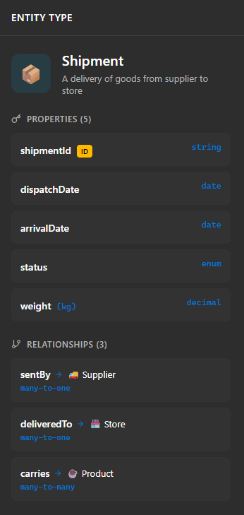

# Property Extraction — Design Proposal

**Status:** Draft for review, revised 2026-05-25 per Codex review rounds 1 and 2
**Author:** Generated via Claude Code session, 2026-05-25
**Reviewers:** Codex (r1 APPROVE-WITH-CHANGES, r2 REJECT — addressed in implementation plan r2; r3 APPROVE — design doc unchanged at r3)
**Related docs:** [PROFILE_INDUCTION_ARCHITECTURE.md](./PROFILE_INDUCTION_ARCHITECTURE.md),
[PROFILE_SPEC.md](./PROFILE_SPEC.md), [SPIRES.md](./SPIRES.md),
[PROPERTY_EXTRACTION_IMPLEMENTATION_PLAN.md](./PROPERTY_EXTRACTION_IMPLEMENTATION_PLAN.md)

**Revisions:**
- 2026-05-25 r1: incorporated Codex review — XSD table expanded, UUID
  corrected to `xsd:string`, `Attribute` dataclass gains `description`,
  Source C/D precedence rewritten around storage-vs-semantic split, OWL
  emission moved off on-property restrictions, URI scheme adds `/rel/`
  branch for object properties to avoid attribute/predicate collision.

---

## 1. Problem Statement

Tycho's current pipeline produces draft ontologies that are **conceptually
correct but property-blind**.

A run on the NPL domain (Basel D403 + governance.json + npl-code AST +
npl-schema.sql) emits an OWL file containing:

- ~30 `owl:Class` entries
- ~12 `owl:ObjectProperty` entries with `rdfs:domain` / `rdfs:range`
- **0 `owl:DatatypeProperty` entries**
- **0 cardinality assertions on object properties**

When loaded into a standard ontology editor (Protégé, IRIS, the
`cosmic-coffee-company-ontology.rdf` reference editor), each entity card
shows a name and label, but no fields. The reference pattern looks like:



```
ENTITY TYPE: Shipment
  Properties (5):
    shipmentId      string  (ID)
    dispatchDate    date
    arrivalDate     date
    status          enum
    weight (kg)     decimal
  Relationships (3):
    sentBy       → Supplier    many-to-one
    deliveredTo  → Store       many-to-one
    carries      → Product     many-to-many
```

Tycho today produces only the bottom (relationships) half, never the top
(properties) half.

### Why this matters

1. **Curator friction.** The OWL file is Tycho's handoff artefact to a
   human curator. A class with no properties forces the curator to
   reconstruct every field by hand from the source files — exactly the
   work Tycho is supposed to bootstrap.
2. **Validation rules underused.** The profile schema already supports
   `required_fields` per entity type (used by VR003 in
   `core/validation.py`), but without per-entity attribute extraction we
   have nothing to validate against.
3. **Code-anchored domains pay double.** For domains that already supply
   structured field information (SQL DDL, Pydantic models, dataclasses),
   the data is parsed by Tycho's extractors but discarded before fusion.

### Root cause

Two independent gaps, both intentional in earlier phases:

1. **The SPIRES LinkML template used by `domain_doc_extractor.py` is
   flat.** It declares two slots — `concepts` and `relationships` — and
   no per-class attribute schema. SPIRES (per
   [SPIRES.md](./SPIRES.md) §2-3) is *capable* of nested per-class
   attribute extraction; Tycho's template doesn't ask for it.
   See `src/ontozense/extractors/domain_doc_extractor.py:282-326`.
2. **`candidate-graph.json` is lossy for field metadata.** Source C
   columns (parsed by `sqlglot`) and Source D class fields (parsed by
   AST) carry column name, SQL type, primary-key flag, foreign-key
   target, and nullability. The candidate graph keeps the *table name*
   as a concept but drops everything below it. Fusion therefore never
   sees field data, and the OWL exporter at `core/owl_export.py:72-106`
   correspondingly never emits any `owl:DatatypeProperty`.

### Constraint: domain agnosticism

Tycho is designed to bootstrap ontologies across **arbitrary domains**,
not just NPL. The property-extraction design must work across all of:

| Domain shape           | Source A docs | Source C SQL | Source D code | Comment                |
|------------------------|---------------|--------------|---------------|------------------------|
| NPL (current)          | ✓ Basel       | ✓ schema     | ✓ Python      | Strong code anchor     |
| Pure regulatory        | ✓             | ✗            | ✗             | Doc-only               |
| SaaS data model        | ✗             | ✓            | ✓             | No prose docs          |
| Wet-lab biology        | ✓ papers      | ✗            | ✗             | Doc-only               |
| Manufacturing / ERP    | ✓ specs       | ✓ DDL        | partial       | Mixed                  |

A solution that only works when Source C or D are present (deterministic
extraction) is insufficient. A solution that only works via LLM
(expensive, less reliable) is insufficient. We need both, layered.

---

## 2. Goals

1. **Per-class `owl:DatatypeProperty` emission** with `rdfs:domain`
   pointing at the parent class and `rdfs:range` set to an `xsd:*` type.
2. **Per-class `owl:ObjectProperty` cardinality** annotations
   (`owl:FunctionalProperty`, `owl:maxCardinality`, etc.) where source
   data supports them.
3. **Provenance per attribute**, mirroring the existing
   `field_provenance` infrastructure used for element-level fusion.
4. **Domain-agnostic fallback chain** — deterministic sources preferred,
   LLM extraction triggered only when no deterministic data exists.
5. **Profile-aware** — the induced profile and any human-edited profile
   can declare expected attributes per entity type, used both as priors
   for extraction and as inputs to validation.
6. **No regression** on the existing concept/relationship pipeline. The
   current profile-driven workflow stays default and unchanged.

## 3. Non-Goals

- **Not** instance-level data extraction. We extract the schema
  (`Customer has field customerId of type string`), never instances
  (`Customer #123, name "Alice"`).
- **Not** full SHACL or OWL2-DL inference. The exporter stays at the
  level of axiom emission; consistency checking is left to downstream
  tools (Protégé reasoner, ROBOT).
- **Not** automatic foreign-key inference across unrelated sources. FK
  detection is limited to what the SQL parser and AST extractor already
  surface.
- **Not** a redesign of `candidate-graph.json` semantics — we add a
  parallel attribute channel rather than re-shape the existing fields.

---

## 4. Proposed Solution

Three phases, sequential. Each phase delivers independent user-visible
value. Phase A unblocks code-anchored domains; Phase B adds doc-only
domains; Phase C closes the loop with profile-driven validation.

### Phase A — Deterministic property extraction (Source C + D + B)

**What:** persist field-level data from existing extractors into
`discovery/`, carry it through fusion, emit `owl:DatatypeProperty` in
the OWL output.

**Source signals:**

- **Source C (SQL DDL via `sqlglot`)** — columns become datatype
  properties. SQL type → XSD type mapping (e.g. `VARCHAR` → `xsd:string`,
  `DECIMAL` → `xsd:decimal`, `DATE` → `xsd:date`). Primary key → ID
  annotation. Foreign key → object property domain/range + functional
  annotation (many-to-one).
- **Source D (Python AST)** — Pydantic/dataclass/SQLAlchemy fields
  become datatype properties. Python type → XSD type mapping. Field
  with `default_factory=list` → multivalued. Field with `unique=True`
  on a SQLAlchemy column → ID candidate.
- **Source B (governance.json)** — `data_type` field, when populated,
  becomes the XSD type. `enum_values` when populated becomes an
  `owl:oneOf` enumeration.

**Pipeline changes:**

1. New file `discovery/source-c.json` written by `survey` containing
   the full table → columns map (name, sql_type, nullable, pk, fk_target).
2. New file `discovery/source-d.json` written by `survey` containing the
   full class → fields map (name, py_type, default, multivalued).
3. `core/fusion.py` extended: each `FusedElement` gains an `attributes:
   list[Attribute]` field. Attribute carries `name`, `xsd_type`,
   `is_id`, `is_multivalued`, `enum_values`, and `field_provenance` (one
   entry per source that contributed).
4. `core/fusion.py` adds attribute-level fusion: when Source C says
   `customer.email VARCHAR(255)` and Source D says `Customer.email: str`,
   merge into a single `Attribute(name="email", xsd_type="xsd:string")`
   with provenance from both sources.
5. `core/owl_export.py` emits `owl:DatatypeProperty` per attribute,
   `owl:FunctionalProperty` for ID and many-to-one FK attributes.

**What ships in Phase A:**

- For NPL, the draft.owl will contain typed properties for every
  table/class present in `npl-schema.sql` and `npl-code/`.
- For SaaS / pure-data-model domains, full entity cards land
  immediately.
- For doc-only domains, no change — Phase B fills that gap.

**Acceptance:**

- `draft.owl` for NPL contains ≥ 1 `owl:DatatypeProperty` per class
  that has a backing table in `npl-schema.sql` or a backing class in
  `npl-code/`.
- All existing tests pass.
- A new test fixture covers an end-to-end run with synthetic SQL +
  Pydantic input, asserting per-attribute XSD types and ID flags.

### Phase B — LLM property extraction (SPIRES Pass-2)

**What:** for domains where Phase A produces no attributes on a given
concept *and* Source A documents exist, run a second SPIRES extraction
pass with a per-class LinkML template asking the LLM to enumerate
attributes from the source text.

#### Pre-spec scope lock (5-gate)

This spec deliberately constrains Phase B so it cannot sprawl into
adjacent concerns. Each gate is a hard limit, not a guideline.

**Gate 1 — eligibility.** Phase B runs ONLY for FusedElements where
`attributes == []` **after Phase A fusion AND after Phase D rule
projection**. If anything deterministic (Source C / D / B) produced
even one attribute, Phase B does NOT run for that element. No
"top up" of partial attribute lists, no "improve descriptions"
side-effect — Phase B fills empty cells only.

**Gate 2 — opt-in only.** Triggered exclusively via the new CLI flag
`--property-induction llm` on `draft`. Default off. No environment
variable override, no per-domain YAML toggle. Two reasons: LLM cost
is user-visible and per-run consent matters; reproducibility of the
default `draft` invocation is a Phase A guarantee we don't break.

**Gate 3 — no Phase C validation.** Phase B does not consult any
profile-declared attribute schema (Phase C territory). It does not
emit any `required` / cardinality assertions. It does not flag
missing required attributes. The LLM-induced `Attribute` records
look exactly like Source C / D ones in shape, with `field_provenance`
source = `"B-LLM"` and lower confidence (default 0.5, see §5).
Phase C, when it ships, can layer validation rules on top.

**Gate 4 — no Phase E rule semantics.** Phase B extracts ATTRIBUTES
(typed properties on entities), not rules. It does not produce
`BusinessRule` records. It does not invent `ontozense:businessRule`
annotations. If the LLM accidentally returns rule-shaped output the
parser rejects it. Rule synthesis from prose is its own future
phase, not Phase B.

**Gate 5 — backlog isolation.** The 37/50 unmatched Source D rules
discovered during PR D1 smoke testing (rules that fusion couldn't
bind to any FusedElement) are a fusion-layer concern. They are
explicitly **out of Phase B scope**. Tracked separately as a backlog
item (§7).

#### Trigger condition

After Phase A fusion + Phase D rule attachment, for each
`FusedElement`:

- `attributes == []` AND
- element has at least one `field_provenance` entry from Source A
  (i.e. it was discovered in a doc, not synthesised from B/C/D
  alone) AND
- `--property-induction llm` flag passed on `draft`.

Domain has zero Source A docs → Phase B is a no-op for every element
(no source text to extract from).

#### Mechanism

1. `core/property_induction.py` (new) generates a LinkML template per
   eligible class with the SPIRES patterns from
   [SPIRES.md](./SPIRES.md) §3.1:
   ```yaml
   classes:
     Customer:
       attributes:
         attributes:
           description: |-
             A list of attributes of Customer. Each item must be a single
             line in the format:  attribute_name :: XSD_TYPE :: description
             where XSD_TYPE is one of: xsd:string, xsd:integer,
             xsd:decimal, xsd:date, xsd:dateTime, xsd:boolean, xsd:anyURI,
             or an enum value set.
           multivalued: true
   ```
2. Source text passed to SPIRES = the segments where the class was
   originally discovered (use `field_provenance[*].anchor.snippet`,
   capped to avoid exceeding model context — see §5 contracts).
3. SPIRES output parsed into `Attribute` records via the existing
   Phase A `Attribute` dataclass shape. Source set to `"B-LLM"`
   (distinguishes from Source B governance) with `confidence = 0.5`
   default. Each induced attribute lands on the FusedElement's
   `attributes[]` list.
4. Merged via the same Phase A fusion path. Phase B never overwrites:
   if Phase A / D already produced an attribute (gate 1 above),
   Phase B doesn't run for that element at all. No precedence
   conflict possible by design.

#### Cost / safety controls

Per design §5 the `--property-induction llm` flag accepts three
budget knobs (all optional, sensible defaults):

| Knob | Default | Purpose |
|---|---|---|
| `--property-induction-max-concepts N` | 50 | Hard cap on eligible elements to query. Sorted by Source A confidence desc; lower-confidence concepts skipped when over budget. |
| `--property-induction-max-calls N` | 100 | Hard cap on total LLM calls across the run (covers retries). |
| `--property-induction-token-budget N` | unbounded | Optional total input-token cap. When set, run stops as soon as the cumulative input-token estimate exceeds N. Skipped concepts surface in the draft summary. |

All three defaults can be overridden per call. The CLI prints the
budget summary before running and the actual usage after, so the
user sees both the upper bound and the realised cost.

Per-run cache under `discovery/source-a-properties.json` records
`{class_uri: [Attribute, ...]}` and is consulted **only when
`--property-induction llm` is explicitly set on the rerun**. Reruns
of `draft` WITHOUT the flag never read the cache and never emit the
cached attributes — Gate 2 (opt-in) + the regression guard
("default-flag run = byte-identical to pre-Phase-B") both depend on
this. Reruns WITH the flag use the cache to skip already-induced
classes (cache hit = skip the LLM call; refresh via
`--property-induction-refresh`).

#### Acceptance

- **Fixture 1 — doc-only domain (gate 1+2 prove value):** a
  fixture domain with Source A only (no SQL, no Python). Running
  `draft --property-induction llm` produces a `draft.owl` where the
  top-5 Source A concepts by confidence carry at least one
  `owl:DatatypeProperty` each. Without the flag, those classes
  remain property-blank.
- **Fixture 2 — deterministic-rich domain (gate 1 prove no-op):** a
  fixture domain identical to today's synthetic Phase A test set
  (Source C SQL + Source D Python). Running
  `draft --property-induction llm` produces a `draft.owl` byte-
  identical (graph-isomorphic via `rdflib.compare.isomorphic`) to
  the run WITHOUT the flag. Gate 1 means Phase B has nothing to do
  when everything's already typed.
- **Regression guard (Phase A default unchanged):** running `draft`
  without `--property-induction llm` on any fixture produces output
  byte-identical to pre-Phase-B for the same inputs. Default
  behaviour preserved end-to-end.
- **Budget enforcement:** when `--property-induction-max-concepts 3`
  is set, the run executes exactly 3 LLM calls (one per eligible
  concept). Concepts beyond budget land in
  `draft-summary.md` under a "Skipped (budget)" section.

### Phase C — Profile-declared attribute schemas

**What:** extend the profile schema (`PROFILE_SPEC.md`) to allow
declaring expected typed attributes per entity type, and add a single
validation rule (VR007) that flags fused elements whose extracted
`attributes[]` list does not satisfy the profile-declared `required:
true` attributes for their type.

#### Pre-spec scope lock (5-gate)

Phase C is deliberately the smallest reviewable wedge of
profile-driven attribute validation. Each gate is a hard limit, not
a guideline. The goal is a single PR-pair that ships a parser
addition + one new validation rule + three acceptance fixtures.

**Gate 1 — scope.** Phase C ships exactly two things and nothing else:

1. A new `entity_types[*].attributes[]` declaration on
   `schema.json` (parser + dataclass + load-time validation).
2. A new `VR007` (Required attributes present) entry in the existing
   `core/validation.py` six-rule pipeline.

Out of scope inside the gate: any change to extraction priors
(Phase B SPIRES template stays untouched), any change to
profile-induction's draft-profile emission (draft profiles will not
yet suggest attribute schemas — that lands in Phase C v2), any
change to OWL emission, any change to fusion-layer behaviour.

**Gate 2 — opt-in.** Profile-driven: there is no new CLI flag. A
profile that does not declare `attributes` on any entity type makes
VR007 a guaranteed no-op (no finding can fire). The CLI surface of
`ontozense validate` is unchanged. Reruns on profiles authored
before Phase C produce byte-identical validation output to a
pre-Phase-C run on the same inputs (the regression guarantee — see
Gate 4).

**Gate 3 — Phase E independence.** Phase C emits **no** SHACL
shapes, **no** SWRL Horn-clause rules, **no** `owl:Restriction`
axioms on attributes (cardinality, value range, enum membership),
**no** SPIN, and triggers **no** reasoner integration. The `is_id`
/ `is_multivalued` / `enum_values` profile fields are stored on
the loaded `Profile` and surfaced via tooling, but **no Phase C
rule consumes them** — they are informational data for downstream
consumers and for the OWL exporter to potentially leverage in the
future. Adding cardinality / enum / type checks against extracted
attributes is the Phase E surface, blocked on the same contract
upgrade that gates L2 / L3 rule projection (see §4 Phase E
placeholder).

**Gate 4 — backward compatibility.** All pre-Phase-C profiles
parse byte-identically. The loader change is purely additive:
`EntityType.attributes` defaults to `[]`. VR007 walks zero
attribute specs on those profiles and produces zero findings.
The dedicated regression fixture (Fixture 3 below) proves this.
No `profile_version` bump is required for Phase C; existing
profiles that opt in to `attributes` may bump their version per
their own author policy, but Tycho neither enforces nor rejects
either choice.

**Gate 5 — backlog isolation.** The following items are
**explicitly out of Phase C scope** and will be tracked separately
if and when they're picked up:

- Profile-induction emission of suggested `attributes` blocks in
  the auto-generated draft profile. (Currently profile-induction
  in `core/profile_induction.py` emits `entity_types` blocks
  without `attributes`. Extending it is a separate, value-additive
  workstream.)
- Phase B SPIRES template using profile-declared attribute names as
  priors to improve LLM recall. (Today's Phase B template is
  prior-free per design §4 Phase B Mechanism step 1; introducing
  priors is a Phase B v2 / Phase C v2 question, not Phase C v1.)
- Per-attribute XSD-type mismatch checks (extracted attribute
  declares `xsd:integer` but profile declares `xsd:string`).
  Gate 3 places this in Phase E territory.
- Per-attribute cardinality / multivaluedness / enum-membership
  checks against extracted values. Gate 3 places these in Phase E.
- Subtype-level attribute overrides (a subtype declaring its own
  `attributes` list distinct from the parent). PROFILE_SPEC.md
  explicitly says subtypes inherit and may not override in Phase C.

#### Profile additions

```json
"entity_types": {
  "Customer": {
    "required": [],
    "optional": [],
    "attributes": [
      { "name": "customerId", "xsd_type": "xsd:string", "is_id": true,  "required": true },
      { "name": "email",      "xsd_type": "xsd:string",                  "required": true },
      { "name": "createdAt",  "xsd_type": "xsd:dateTime",                "required": false }
    ]
  }
}
```

Full schema, defaults, shape rules, and backward-compat policy live
in [PROFILE_SPEC.md `attributes` per entity type](./PROFILE_SPEC.md#attributes-per-entity-type).

#### Mechanism

1. `core/profile.py::_parse_entity_types` reads the optional
   `attributes` list per entity type, parses each entry into a new
   `ProfileAttribute` dataclass (see §5 contracts), and rejects
   load-time errors (unknown `xsd_type`, duplicate `name` within a
   type, multiple `is_id: true`).
2. `EntityType.attributes: list[ProfileAttribute] = []` carries the
   parsed declarations through to the rest of the engine.
3. `core/validation.py::validate` gains a new call to
   `_check_vr007_required_attributes(elements, profile, result)`
   after the existing `_check_vr003_required_fields` call.
4. VR007 walks every element of a known entity type, looks up the
   type's `attributes`, and for each entry with `required: true`
   checks that an `Attribute` with a name-matching `name` appears
   on `element.attributes[]`. Missing entries produce one
   `ValidationFinding(rule_id="VR007", severity="warning", ...)`
   per element per missing attribute name.
5. `core/profile_induction.py` is **not** touched in Phase C.
   Profile-induction continues to emit `entity_types` blocks
   without `attributes` — extending it is in Gate 5 backlog.

#### Acceptance

- **Fixture 1 — required missing fires:** a profile declaring
  `Customer.attributes[]` with `customerId` and `email` both
  `required: true`. A fused result where the `Customer` element
  carries only `email` on its `attributes[]`. Running `validate`
  produces exactly one VR007 finding listing `customerId` as the
  missing required attribute, severity `warning`, with the
  element's ID as `target_id`.
- **Fixture 2 — complete profile silent:** the same profile. A
  fused result where the `Customer` element carries both
  `customerId` and `email` on its `attributes[]`. Running
  `validate` produces zero VR007 findings.
- **Fixture 3 — no-attrs default regression:** a profile that
  declares no `attributes` on any entity type (the pre-Phase-C
  shape — e.g. the minimal profile from PROFILE_SPEC.md
  "Example: minimal profile"). Any fused result. Running
  `validate` produces validation output byte-identical
  (`ValidationResult.findings`, surviving `elements`, surviving
  `relationships`, and summary counts) to a pre-Phase-C run on
  the same inputs. VR007 must not appear anywhere in the output.

### Phase D — Source D business-rule projection to OWL (annotation layer)

**What:** project the `FusedElement.business_rules` already populated
by the existing Source D fusion path (50 rules on the NPL fixture
today) into the OWL output **as curator-visible annotations**. Today
these rules survive in `fused.json` but never reach `draft.owl`, so
the curator's entity-card view stops at typed properties and never
shows the conditional logic that qualifies them (thresholds,
eligibility predicates, state transitions, SQL CHECK semantics).

Phase D is **independent of A / B / C**. A handled per-entity
attributes (`DatatypeProperty`). Phase D handles per-entity rules:
constants, conditionals, functions, SQL CHECK constraints, SQL WHERE
clauses, SQL views, comment citations — the rule types actually
present on today's `BusinessRule` shape.

**Why this matters:**

A class like `NonPerformingExposure` today shows up in `draft.owl` as:

```turtle
:non_performing_exposure a owl:Class ;
    rdfs:label "Non-Performing Exposure" ;
    rdfs:comment "..." .
```

But the codebase carries the *defining rule*
(`NPE_DPD_THRESHOLD = 90`, `if days_past_due > 90: ...`) on the
FusedElement.business_rules list and the curator never sees it.
Reconstructing those rules from the source files by hand is exactly
the work Tycho is supposed to bootstrap — same gap argument Phase A
made for attributes, now for rules.

**Three-layer projection — Phase D ships L1 only; L2/L3 deferred to Phase E.**

Codex round-1 review (2026-05-26) flagged a contract-level constraint
on the original four-PR proposal: today's `BusinessRule` dataclass
(`src/ontozense/core/fusion.py:148`) carries `rule_type`, `name`,
`expression`, `description`, `value`, `referenced_symbols`,
`citations`, `docstring`, `confidence`, `anchor` — and **nothing
else**. No `subject_attribute`, no `predicate`, no `object_value`, no
`condition`. The richer `RuleFact` shape exists in
`src/ontozense/core/ingest/source_d/ir.py:74` (with
`subject_attribute`, `predicate`, `object_value`, `condition`) but it
does NOT reach `FusedElement.business_rules` today — the Source D
fusion path goes through `extractors/code_extractor.py::CodeRule`
which has the narrower shape.

L2 OWL restrictions and L3 SWRL rules need that richer structure to
project mechanically. Promising L2/L3 from today's `BusinessRule`
would force inline parsing of `expression` strings — exactly the
kind of fragile heuristic the deterministic-only Phase A scope
avoided.

**Phase D therefore ships the annotation layer only.** L2 / L3 land
in a separate Phase E once a small contract upgrade routes the
richer `RuleFact` data into `FusedElement.business_rules` (or a
parallel typed channel). The three-layer architecture stays as a
roadmap; the sequencing is just split.

| Layer | Form | Reasoner impact | Coverage | Status |
|---|---|---|---|---|
| **L1 Annotation** | `ontozense:businessRule "expr"` + structured annotations on the class | None | 100% of `BusinessRule` records | **Phase D (this doc).** |
| **L2 OWL Restriction** | `Class subClassOf (hasField some xsd:integer[> N])` | DL-reasonable | Constants + simple validations + SQL CHECK | Phase E. Blocked on contract upgrade. |
| **L3 SWRL rule** | `Cls(?x) ^ hasField(?x, ?v) ^ greaterThan(?v, N) → DerivedCls(?x)` | Pellet-reasonable | Conditionals + eligibility + derivations + state transitions | Phase E. Blocked on contract upgrade. |

**Per-rule_type annotation policy (Phase D — L1 only):**

The set of `rule_type` values matches what `CodeExtractor` actually
emits today (per `extractors/code_extractor.py:77`):

| `rule_type` | Source example | L1 annotation emitted |
|---|---|---|
| `constant` | `NPE_DPD_THRESHOLD = 90` | `ontozense:businessRule` + `ontozense:ruleValue` |
| `conditional` | `if dpd > 90: stage = "NPE"` | `ontozense:businessRule` |
| `function` | named function with body | `ontozense:businessRule` (the rendered `rule.description` from `_rule_to_description` already includes the first docstring sentence — no extra node, no extra triple) |
| `sql_check` | SQL `CHECK (col IN (...))` | `ontozense:businessRule` |
| `sql_where` | SQL `WHERE col = ...` | `ontozense:businessRule` |
| `sql_view` | SQL `CREATE VIEW ...` | `ontozense:businessRule` |
| `comment_citation` | regulatory reference | `ontozense:businessRule` + `dc:source` per citation |

**Acceptance (Phase D):**

- For NPL: every `BusinessRule` on `fused.json` (~50 today) projects
  to exactly one `ontozense:businessRule` annotation on the parent
  class in the regenerated `draft.owl`.
- `--emit-rules annotations` is the **default** so existing draft
  invocations get the new annotations transparently. The annotations
  are pure additions — no triple deletion, no URI break.
- `--emit-rules none` produces byte-identical `draft.owl` to
  pre-Phase-D for the same inputs (regression guard).
- Curator opens NPL `draft.owl` in Protégé and sees per-class
  `ontozense:businessRule` annotations on the class info pane with
  the rule expression, type, anchor, and citations.

**Phase E (deferred, separate spec) — L2 + L3 reasoner forms.**

When the `BusinessRule` contract grows the `RuleFact` shape (or a
parallel typed channel arrives), Phase E adds:

- L2 OWL restriction emission (`owl:Restriction` on parent class for
  constants bound to attributes; `owl:oneOf` for SQL CHECK IN;
  property restrictions for simple validations).
- L3 SWRL Horn-clause emission for conditional / eligibility /
  derivation / transition rules with the structured `subject_entity`
  + `subject_attribute` + `predicate` + `object_value` payload.

Phase E will get its own design doc + plan + Codex cycle. Not in
scope here; only mentioned so the L1 emission shape stays
forward-compatible (annotations don't preclude later restrictions /
SWRL on the same rule).

---

## 5. Design Contracts

### Attribute dataclass (new)

```python
@dataclass
class Attribute:
    name: str                                  # "customerId"
    xsd_type: str                              # "xsd:string"
    description: str = ""                      # human-readable, from D docstrings / SQL COMMENT
    is_id: bool = False                        # PK or @id
    is_multivalued: bool = False               # collection / list / ARRAY
    is_nullable: bool = True                   # NOT NULL → False
    enum_values: list[str] = field(default_factory=list)
    raw_type: str = ""                         # original SQL/Python type verbatim (for curator)
    field_provenance: list[FieldProvenance] = field(default_factory=list)
    confidence: float = 1.0                    # 1.0 for deterministic
```

Revision note (r1): `description` and `raw_type` added per Codex review.
Without `description` the Source C/D precedence rule (§6 / Open Question #4)
was not implementable. `raw_type` lets the curator see the original
SQL/Python type when the XSD mapping was lossy (e.g. `DECIMAL(10,2)` →
`xsd:decimal`).

### XSD type mapping

Revised table (r1) — adds 11 types Codex flagged as missing; corrects
UUID from `xsd:anyURI` to `xsd:string`.

| Source type                                    | XSD output         | Notes                              |
|------------------------------------------------|--------------------|------------------------------------|
| VARCHAR / TEXT / CHAR / str / CITEXT           | `xsd:string`       |                                    |
| SMALLINT / INT / BIGINT / SERIAL / BIGSERIAL / int | `xsd:integer`  | All integer widths collapse        |
| DECIMAL / NUMERIC / MONEY / Decimal            | `xsd:decimal`      | Precision recorded in `raw_type`   |
| FLOAT / REAL / DOUBLE PRECISION / float        | `xsd:double`       |                                    |
| DATE                                           | `xsd:date`         |                                    |
| TIME                                           | `xsd:time`         |                                    |
| TIMESTAMP / datetime                           | `xsd:dateTime`     |                                    |
| TIMESTAMPTZ / `timestamp with time zone`       | `xsd:dateTimeStamp`| Carries timezone                   |
| INTERVAL                                       | `xsd:duration`     |                                    |
| BOOLEAN / bool                                 | `xsd:boolean`      |                                    |
| BLOB / BYTEA / bytes                           | `xsd:base64Binary` |                                    |
| UUID                                           | `xsd:string`       | r1: was `xsd:anyURI`               |
| JSON / JSONB                                   | `xsd:string`       | Annotated `rdfs:comment "json"`    |
| GEOMETRY / GEOGRAPHY                           | `xsd:string`       | WKT serialisation assumed; flagged |
| ARRAY / list[T] / `T[]`                        | XSD of element T   | `is_multivalued = True`            |
| Enum / Literal[...]                            | XSD of member type | `enum_values` populated            |
| Anything else                                  | `xsd:string`       | `rdfs:comment` records original    |

Unknown / vendor-specific types default to `xsd:string`. The original
type string is preserved in both `raw_type` (machine-readable) and an
`rdfs:comment` on the property (curator-visible).

### OWL emission rules (Phase A)

Revision note (r1): Codex flagged on-property `owl:minCardinality` and
`owl:oneOf` as not idiomatic OWL2-DL. Phase A uses **annotations only**
for cardinality and enum (curator-visible, no reasoner impact); proper
class-restriction encoding moves to Phase C alongside the profile
schema work that already lives in `core/validation.py`.

For each `Attribute a` on `FusedElement e`:

```turtle
<{base}/{e.id}/{a.name}> a owl:DatatypeProperty ;
    rdfs:label "{a.name}" ;
    rdfs:domain <{base}/{e.id}> ;
    rdfs:range {a.xsd_type} ;
    {if a.description}    rdfs:comment "{a.description}" ; {endif}
    {if a.is_id}          a owl:FunctionalProperty ; {endif}
    {if not a.is_nullable} ontozense:required "true"^^xsd:boolean ; {endif}
    {if a.enum_values}    ontozense:enumValues "{v1};{v2};..." ; {endif}
    {if a.raw_type}       ontozense:rawType "{a.raw_type}" ; {endif}
    .
```

`ontozense:` is a custom annotation namespace bound in the graph
header. Curators see the cardinality/enum information; reasoners
ignore unknown annotation properties, so no DL inconsistency is
introduced.

### URI naming (revised r1)

Revised per Codex review to give object properties a separate URI
branch so attributes named after predicates don't collide.

| Element kind         | URI pattern                          | Example                                           |
|----------------------|--------------------------------------|---------------------------------------------------|
| `owl:Class`          | `{base}/{class_fragment}`            | `https://tycho.local/npl/borrower`               |
| `owl:DatatypeProperty` | `{base}/{class}/{attr}`            | `https://tycho.local/npl/borrower/email`         |
| `owl:ObjectProperty` | `{base}/rel/{predicate_fragment}`    | `https://tycho.local/npl/rel/has_collateral`     |

Matches the cosmic-coffee pattern for classes and datatype properties,
adds the `/rel/` branch as a Codex-recommended improvement. Migration
note: existing draft.owl files (pre-r1) have object properties at
`{base}/{predicate}`. The new scheme is a one-way URI break; consumers
generating reports off old URIs need to update. No data migration
needed because Tycho's OWL output is a handoff artefact, not a stored
identifier source.

### Phase D contracts — annotation-layer rule projection

Phase D ships L1 annotations only. The contracts below cover that
delivery; the L2 / L3 contracts (RuleProjection layers, SWRL
namespace, `/rule/` URI branch) move to the Phase E design doc when
that phase is scoped.

**`RuleAnnotation` dataclass (new, internal):**

```python
@dataclass
class RuleAnnotation:
    rule: BusinessRule                   # the source rule (unchanged)
    parent_class_uri: URIRef             # owl:Class the rule attaches to
    triples: list[tuple]                 # ready-to-add (s, p, o) tuples
```

Pure data carrier — no projection logic on the class. One annotation
per `BusinessRule` per parent class (when a rule binds to multiple
classes, see decision D7 in §9 for the binding policy).

**Annotation namespace additions:**

Phase D extends the `ontozense:` namespace introduced in PR3 with:

- `ontozense:businessRule`     — rule expression (verbatim source text)
- `ontozense:ruleType`         — `constant` / `conditional` / `function` / `sql_check` / `sql_where` / `sql_view` / `comment_citation` (the set CodeExtractor actually emits today)
- `ontozense:ruleAnchor`       — `"file:line"` for click-through
- `ontozense:ruleConfidence`   — 0.0-1.0
- `ontozense:ruleValue`        — for `rule_type=constant`, the literal value (string-coerced)
- `ontozense:ruleReferencedSymbols`  — semicolon-joined list
- `dc:source`             — one triple per entry in `rule.citations`

All annotation properties live on the parent `owl:Class`. No new
URIs introduced (rules don't get their own URIs in L1; that's a
Phase E concern when reasoner-form needs addressable rule nodes).

**Rule-to-class binding policy (Phase D — annotation-only):**

For each `BusinessRule` on a `FusedElement`:

1. Bind to the `FusedElement` it already sits on (the existing fusion
   path already resolved this — Source D `_merge_source_d` attaches
   each `CodeRule` to the right element via `attached_to_entity_id`
   or `referenced_symbols` matching).
2. **No "attach to all" fallback** in Phase D — the rule annotation
   stays exactly where fusion put it. Ambiguous bindings are a
   fusion-layer concern, not a projection-layer concern.
3. **Conflict between rules** (e.g. two constants on the same field
   with different values): emit BOTH annotations on the parent
   class. No reasoner-form to suppress (Phase D has no L2/L3), so
   no conflict log produced at the emission layer. Fusion does not
   currently log rule conflicts either — `_merge_source_d` appends
   rules to `el.business_rules` without conflict detection. If
   rule-conflict detection is needed it belongs in fusion, not in
   Phase D emission. For now both rules are surfaced verbatim and
   the curator resolves at review time.

**CLI flag (Phase D scope only):**

`ontozense draft ... --emit-rules <mode>` where `mode` is:

- `annotations` — emit `ontozense:businessRule` annotations (Phase D
  default — enables the new behaviour for existing draft invocations
  without breaking byte-identity guarantees from earlier phases).
- `none` — skip rule projection entirely. `BusinessRule` records
  remain in `fused.json` but never reach `draft.owl`. Matches
  pre-Phase-D behaviour exactly. Use for regression comparisons.

The Phase E spec will extend this enum with `restrictions`, `swrl`,
and `all`. Until then those values are rejected by the CLI with a
"not yet implemented (queued for Phase E)" error message that
points at the future spec.

### Phase B contracts — LLM-induced attribute projection

Phase B reuses the existing `Attribute` dataclass shape (Phase A
§5). The only contract additions are around provenance, source
text selection, and budget enforcement.

**`Attribute.field_provenance` source label:**

Phase B adds a single source code: **`"B-LLM"`** (distinguishes
from Source B governance which uses `"B"`). The `FieldProvenance`
record carries:

```python
FieldProvenance(
    source="B-LLM",
    artifact="discovery/source-a-properties.json",   # cache path
    line=0,                                          # not applicable
    confidence=0.5,                                  # Phase B default
    extractor="spires-pass2",
)
```

Confidence default is 0.5 (intentionally lower than Source C/D's
1.0 and Source B governance's 0.7) so reviewers immediately see
which attributes came from the LLM and need closer scrutiny.

**Source text selection (avoid context-window blowouts):**

Per-class input to SPIRES = concatenation of
`field_provenance[*].anchor.snippet` from the FusedElement's
Source A entries, capped at `MAX_SPIRES_INPUT_CHARS` (default 8000
chars ≈ ~2000 tokens for English prose). Cap is per-class, not
per-run. When the cap fires, the run logs a per-class truncation
record into `discovery/source-a-properties.json` so the curator
sees that a longer snippet was available but Phase B chose to
truncate.

**Cache shape (`discovery/source-a-properties.json`):**

```json
{
  "schema_version": "1.0",
  "model": "azure/gpt-5.4",
  "generated_at": "2026-05-26T...",
  "budget": {
    "max_concepts": 50,
    "max_calls": 100,
    "token_budget": null
  },
  "usage": {
    "concepts_processed": 12,
    "calls": 12,
    "tokens_estimated": 4321
  },
  "per_class": {
    "https://tycho.local/<domain>/customer": {
      "attributes": [ {Attribute serialised}, ... ],
      "input_truncated": false,
      "skipped_reason": null
    },
    ...
  },
  "skipped": [
    {"class_uri": "...", "reason": "budget:max_concepts"},
    ...
  ]
}
```

**CLI flags:**

- `--property-induction llm` — opt-in gate. Default off.
- `--property-induction-max-concepts N` — default 50.
- `--property-induction-max-calls N` — default 100.
- `--property-induction-token-budget N` — default unbounded.
- `--property-induction-model M` — default `azure/gpt-5.4` (literal,
  matches the explicit default on `extract-a`, `survey`, and
  related LLM-using commands in the current codebase — no env-var
  indirection because no `EXTRACT_A_MODEL` env contract exists
  today). Same LiteLLM-style identifier accepted by `--model` on
  `extract-a` / `survey`.

**Merge precedence with deterministic attributes:**

None. Gate 1 (scope lock) makes precedence a non-issue: Phase B
runs only when `attributes == []` after Phase A + D. There is
nothing for B-LLM to overwrite or conflict with by construction.

If a future user passes `--property-induction llm` on a domain
where Phase A already attributed every concept, every element is
skipped — `usage.concepts_processed = 0`, zero LLM calls, zero
attributes added. The CLI prints a clear "no eligible concepts"
note.

### Phase C contracts — profile-declared attribute schemas

Phase C adds a single dataclass and a single validation rule. No
existing dataclass is mutated; no existing rule is mutated; no
existing CLI flag is changed.

**`ProfileAttribute` dataclass (new, frozen, in `core/profile.py`):**

```python
@dataclass(frozen=True)
class ProfileAttribute:
    name: str                                  # canonical attribute name
    xsd_type: str                              # canonical XSD identifier
    description: str = ""
    required: bool = False                     # VR007 fires when missing
    is_id: bool = False                        # at most one per entity_type
    is_multivalued: bool = False               # informational in Phase C
    enum_values: list[str] = field(default_factory=list)  # informational

    @property
    def name_key(self) -> str:
        """Case-insensitive lookup key. Lowercased + stripped."""
        return self.name.strip().lower()
```

Frozen for the same reason as `EntityType` / `Predicate`: profiles
are configuration, passed around and never mutated. `name_key` is a
computed property (no extra stored state) used by VR007 for
case-insensitive matching against extracted `Attribute.name` values.

**`EntityType` extension:**

```python
@dataclass(frozen=True)
class EntityType:
    name: str
    required_fields: list[str] = field(default_factory=list)
    optional_fields: list[str] = field(default_factory=list)
    subtypes: list[str] = field(default_factory=list)
    attributes: list[ProfileAttribute] = field(default_factory=list)  # NEW
```

Default `[]` preserves byte-identical parse output for any profile
authored before Phase C. The new field is the only additive change
to the `EntityType` contract.

**Allowed `xsd_type` values:**

The Phase C parser accepts only XSD identifiers that already appear
in the Phase A XSD mapping table (§5, "XSD type mapping"). That is:

```
xsd:string, xsd:integer, xsd:decimal, xsd:double, xsd:date, xsd:time,
xsd:dateTime, xsd:dateTimeStamp, xsd:duration, xsd:boolean,
xsd:base64Binary, xsd:anyURI
```

Any other `xsd_type` raises `ProfileError` at load time with a
message listing the accepted values. Rationale: keeping the
profile-declarable set aligned with what extraction can produce
means VR007 (and any future Phase E type-equality rule) never has
to reconcile a profile-declared type that no extractor can ever
emit.

**Loader validation rules added by Phase C:**

`core/profile.py::_parse_entity_types` (and a new
`_parse_profile_attributes(name, raw)` helper) raise `ProfileError`
for each of:

- `attributes` is present but not a list.
- An entry is missing `name` or `xsd_type`, or either is not a
  non-empty string.
- `xsd_type` is not in the accepted set above.
- `required` / `is_id` / `is_multivalued` is present but not a bool.
- `enum_values` is present but not a list of strings.
- Two entries within the same entity type share a `name_key`
  (case-insensitive duplicate).
- More than one entry in the same entity type sets `is_id: true`.

The loader does **not** cross-validate against `required_fields`
/ `optional_fields`. They are independent contracts — `required`
on `attributes` controls VR007, `required` in `required_fields`
controls VR003. Authors may intentionally use both (declaring a
field as required and also a typed property as required).

**`ValidationFinding` shape for VR007:**

```python
ValidationFinding(
    rule_id="VR007",
    severity="warning",
    target_kind="entity",
    target_id=<entity_id_or_element_name>,
    message=(
        f"Entity {el.element_name!r} (type {entity_type!r}) is "
        f"missing required attribute(s): {missing_names}."
    ),
    details={
        "element_name": el.element_name,
        "entity_type": entity_type,
        "missing_required_attributes": ["customerId", "email"],
    },
)
```

One finding is emitted **per element per missing required
attribute** — not one finding per element containing a list. This
mirrors `VR005` (per relationship per domain violation) rather than
`VR003` (one finding per element containing the missing-field list),
because curators downstream typically filter / sort by individual
finding rows and a per-attribute granularity is easier to triage.

Severity is `warning` to match `VR003`'s "required field missing"
sibling. Phase C does not introduce any new severity level.

**When VR007 runs:**

`validate()` calls `_check_vr007_required_attributes(elements,
profile, result)` **after** `_check_vr003_required_fields(...)`
and **before** the relationship-cascade-filter step. Ordering
matters because VR007's input set is `elements` after VR001 /
VR002 have already dropped any entities they would drop in filter
mode. VR007 itself is **annotate-only** (never drops elements
under any mode), matching VR003's behaviour.

**"Present" definition:**

A profile-declared required attribute with `name_key = K` is
considered **present** on `FusedElement el` iff there exists at
least one `Attribute a` in `el.attributes` such that
`a.name.strip().lower() == K`. Empty-name attributes
(`a.name == ""`) never count as present for any `K`. Type
equality, multivaluedness, value-set membership, and `is_id`
flag agreement are **not** part of the presence check in Phase C
(Gate 3).

**B-LLM attribute handling:**

A B-LLM-sourced `Attribute` (`field_provenance[*].source == "B-LLM"`,
confidence 0.5 per Phase B contracts) counts toward VR007 presence
**identically** to deterministic Source C / D / B attributes. No
downgrade, no separate severity, no per-source weighting.

Rationale:

- VR007 is a **structural** rule (does the slot have an entry?),
  not a **confidence** rule. Per-source confidence already rides
  on the attribute's `field_provenance` and is curator-visible
  through the OWL exporter; mixing it into the validation severity
  axis would duplicate the signal and break parity with VR003
  (which doesn't grade required-field confidence either).
- Gate 1 of Phase B (eligibility) already guarantees a B-LLM
  attribute only exists on an element whose `attributes[]` was
  empty after Phase A / D. So if VR007 is satisfied by a B-LLM
  attribute, that signal is meaningful — it means the LLM
  recovered an attribute the deterministic sources missed and the
  profile says is required. Marking that as "warning" would
  defeat Phase B's purpose.
- Downstream consumers that care about confidence can filter the
  fused output's `attributes[*].field_provenance` directly; they
  don't need a special validation rule to surface it.

If a future Phase E rule wants a stricter "B-LLM evidence
insufficient for required" check, that rule lives alongside VR007
rather than replacing its semantics.

---

## 6. Risks and Open Questions

1. **Type-mapping ambiguity for Python.** Pydantic union types
   (`str | int | None`) collapse poorly to a single XSD type. Proposal:
   pick the leftmost non-`None` type; record the full union in
   `rdfs:comment`. Open: is that acceptable, or should we emit
   `owl:unionOf`?
2. **FK direction.** SQL FKs are directional; OWL ObjectProperty
   cardinality requires choosing which side carries the property. We
   propose: FK column on `Order(customer_id)` → emits `customer` object
   property on `Order` with `owl:FunctionalProperty`. Inverse direction
   not auto-emitted.
3. **Many-to-many via junction tables.** Detected when a table has
   exactly 2 FKs and no other non-PK columns. Open: should we also
   detect SQLAlchemy `secondary=` and Pydantic `list[ForeignRef]`
   patterns, or defer to a later phase?
4. **Source C precedence over Source D.** Resolved r1 (Codex review).
   Rule: **Source C wins all storage facts** — `xsd_type`,
   `is_nullable`, `is_id` (PK), foreign-key targets, `enum_values`
   when derived from `CHECK IN (...)`. **Source D wins for
   `description`** (closer to business semantics — read from Python
   docstrings, field-level comments, Pydantic `Field(description=...)`)
   and contributes `is_multivalued` evidence when Python uses
   `list[T]` / `default_factory=list` and Source C is silent. Source B
   `data_type` is consulted only when both C and D are silent; B-only
   attributes get `confidence = 0.7` instead of `1.0`.
5. **Profile induction churn.** If Phase A emits attributes and Phase
   C induces a profile that declares them as `required: true`, a
   subsequent rerun without those source files would flag everything.
   Need a `required` heuristic — propose: `required: NOT NULL in SQL`
   + `description: from comment` only.
6. **LLM cost cap for Phase B.** Per-concept fallback could explode on
   a 200-concept domain. Propose a `--property-induction-budget N` flag
   and skip concepts beyond the budget, sorted by Source A confidence
   descending.
7. **Phase D — annotation truncation for long rule expressions.**
   `BusinessRule.expression` can be a multi-line SQL view or
   function body. Proposal: cap `ontozense:businessRule` literal at
   2000 chars; longer expressions truncate with a trailing "..." and
   carry the full text via `ontozense:ruleAnchor` (file:line for
   click-through). **Open:** is 2000 the right cap, or should we
   keep the full text and accept large OWL files?
8. **Phase D — `BusinessRule.value` typing.** `value` preserves the
   original Python type (int / float / bool / str / list / dict per
   the Tycho 1.0+ contract). For `ontozense:ruleValue`, proposal:
   coerce to str via `repr()` so any value round-trips cleanly into
   one OWL literal. Lossy for complex containers (dict / list become
   their Python repr) but those are rare; curator-visible text is
   the goal. **Open:** acceptable, or emit typed literals for
   primitives and skip containers?
9. **Phase D — citation namespace choice.** **Closed (r2).** Use
   `dc:source` per entry in `rule.citations` to match the existing
   class-level emission at `core/owl_export.py:114` and the tests
   at `tests/test_owl_export.py:149`. No `dcterms:` introduced in
   Phase D. Locked in §9 D5.

Phase E (deferred — see §4 Phase E placeholder) will own its own
open questions for L2 restrictions + L3 SWRL: target reasoner,
rule-to-class binding under richer payloads, SWRL URI stability,
conflict resolution between reasoner-forms.

### Phase B open questions

10. **Phase B — confidence value for B-LLM attributes.** Default 0.5
    proposed (intentionally below B-governance 0.7 + deterministic
    1.0 so reviewers spot LLM-induced attrs at a glance). **Open:**
    is 0.5 the right anchor, or do we want a per-class confidence
    derived from the SPIRES grounding signal?
11. **Phase B — source-text truncation policy.** `MAX_SPIRES_INPUT_CHARS`
    default 8000. **Open:** acceptable, or should we drop snippets
    by confidence instead of truncating the concatenated whole?
12. **Phase B — XSD type default for LLM-induced attrs.** SPIRES
    template asks for `xsd:string | xsd:integer | xsd:decimal |
    xsd:date | xsd:dateTime | xsd:boolean | xsd:anyURI` or an
    enum value set. **Open:** when the LLM returns a type Tycho
    doesn't recognise, default to `xsd:string` (current Phase A
    fallback) or skip the attribute entirely (fail safe)?
13. **Phase B — cache invalidation.** `discovery/source-a-properties.json`
    cache hit = skip the LLM call on rerun. **Open:** invalidate on
    Source A change (file hash) or only when the user explicitly
    passes `--property-induction-refresh`?
14. **Phase B — budget overage behaviour.** When a budget knob fires
    mid-run (e.g. token cap), the run stops. **Open:** stop
    immediately or finish the in-flight call then stop? Finishing
    keeps the partial cache consistent but spends one extra call
    after the cap.

---

## 7. Out of Scope (this design)

- Instance data extraction.
- Reasoner integration (Protégé / ROBOT) for inferred class hierarchy.
- SHACL shape generation.
- SKOS taxonomy emission.
- Cross-domain attribute reuse (e.g. shared `customerId` URI across
  multiple ontologies).
- UI changes — output is OWL only.
- **Phase D scope clarification (r1 — Codex review):** Phase D
  ships annotation-layer emission only (L1). OWL restrictions (L2)
  and SWRL rules (L3) are deferred to Phase E, blocked on a
  `BusinessRule` contract upgrade that routes the richer `RuleFact`
  payload (`subject_attribute`, `predicate`, `object_value`,
  `condition`) into `FusedElement.business_rules`. Phase E will get
  its own design doc + plan once Phase D has shipped and provided
  real-domain feedback on what reasoner-form coverage is worth.
- **Phase D rule synthesis:** Tycho will not invent rules the
  source did not state. The projection layer is mechanical
  (BusinessRule → annotation triples), not semantic. LLM-based rule
  synthesis from prose is deferred (would be analogous to Phase B
  for properties — a separate phase entirely).
- **Reasoner integration:** Tycho still does NOT run a reasoner.
  Phase D / E emit axioms; downstream tools (Protégé reasoner,
  ROBOT, Pellet CLI) run inference. Same policy as Phase A.
- **Fusion-layer Source D rule binding (backlog — discovered during
  PR D1 smoke 2026-05-26):** the NPL smoke produced 50 extracted
  Source D `CodeRule` records but fusion bound only 13 to
  `FusedElement.business_rules`. 37 landed on
  `FusionResult.unmatched_code_rules` and never reach `draft.owl`
  (Phase D explicitly does not project unmatched rules — design
  §9 D7). The binding gap is a fusion-layer concern (improving
  `_merge_source_d`'s symbol-matching, attached_to_entity_id
  resolution, or fuzzy fallback). **Out of scope for Phase B / C /
  D / E.** Tracked here as a separate backlog item; will get its
  own spec if curator feedback shows the unbound rules carry
  curator-relevant content.
- **Phase C scope clarifications (5-gate lock — see §4 Phase C):**
  Phase C ships only the `entity_types[*].attributes[]` parser
  addition + VR007. The following are explicitly **out of Phase C
  scope** and tracked as backlog:
  - Profile-induction emission of suggested `attributes` blocks
    on the auto-generated draft profile.
  - Phase B SPIRES template using profile-declared attribute
    names as priors.
  - Per-attribute XSD-type / cardinality / multivalued / enum
    equality checks on extracted attributes (Phase E surface).
  - `owl:Restriction` / SHACL / SWRL emission from profile-declared
    attributes (Phase E surface).
  - Subtype-level attribute overrides distinct from the parent's
    list.

---

## 8. Decisions (round 1 — Codex review 2026-05-25)

| § | Question | Decision |
|---|---|---|
| 1 | Phase A scope (deterministic only) | **Approved.** |
| 2 | Phase B opt-in via `--property-induction llm` | **Approved.** Concrete plan deferred to a separate Phase B doc. |
| 3 | XSD type mapping table | **Revised** (see §5). UUID corrected to `xsd:string`; 11 types added. |
| 4 | URI naming | **Revised** (see §5). Object properties move to `/rel/` branch to avoid collision with datatype properties named after predicates. |
| 5 | Pydantic union types | **Leftmost non-`None`**; full union preserved in `raw_type` and `rdfs:comment`. `owl:unionOf` deferred — too heavy for Phase A. |
| 6 | Source C / D precedence | **Revised** (see §5 / §6.4). Storage facts from C; description from D; B is silent-fallback only. |

Round-2 decisions (if any) will be appended below.

The implementation plan in
[PROPERTY_EXTRACTION_IMPLEMENTATION_PLAN.md](./PROPERTY_EXTRACTION_IMPLEMENTATION_PLAN.md)
has been revised against these decisions and Codex's plan audit.

## 9. Decisions for Phase D (round 1 — Codex review 2026-05-26)

Phase A has shipped (PRs #14-#18 merged 2026-05-25). Phase D was
added 2026-05-26 after smoke-testing surfaced the gap that Source D
business rules are extracted into `fused.json` but never reach
`draft.owl`. Codex round-1 review flipped the original four-PR
proposal to a single-PR annotation-only delivery; L2 restrictions
and L3 SWRL move to Phase E (deferred).

| § | Question | Decision (r1) |
|---|---|---|
| D1 | Approve Phase D scope (project BusinessRule → OWL)? | **Approved.** Real gap, worth fixing. |
| D2 | Three-layer projection (L1 + L2 + L3) in Phase D? | **Revised.** Three-layer architecture stays as roadmap; L2/L3 deferred to Phase E because today's `BusinessRule` contract lacks the `subject_attribute` / `predicate` / `object_value` / `condition` fields L2/L3 projection needs (per `fusion.py:148` and Codex r1 blocker 2). Phase D ships L1 annotations only. |
| D3 | SWRL emission in Phase D? | **No (revised).** Deferred to Phase E. Requires the contract upgrade above plus the W3C SWRL raw-triple builders. Phase D L1 annotations carry the rule text verbatim so SWRL can be added later without re-emitting the L1 layer. |
| D4 | Default `--emit-rules` flag value? | **`annotations`** (revised from r0 proposal of `all`). With L2/L3 out of scope, `annotations` is the maximum Phase D enables. The default still gives existing draft invocations the new behaviour for free. |
| D5 | Annotation namespace for new properties? | **Approved (closed r2).** `ontozense:` for tycho-specific; **`dc:source`** per `rule.citations` entry. Matches existing class-level emission at `src/ontozense/core/owl_export.py:114` and the tests at `tests/test_owl_export.py:149`. No `dcterms:` introduced in Phase D. |
| D6 | Skip SWRL emission by reasoner detection? | **No reasoner detection.** Moot for Phase D (no SWRL). For Phase E, control via the `--emit-rules` flag, not by sniffing the environment. |
| D7 | Rule-to-class binding when symbol matches multiple classes? | **No "attach to all".** The existing fusion path (`_merge_source_d`) already resolves each `CodeRule` to one parent FusedElement via `attached_to_entity_id` or `referenced_symbols` matching. Phase D respects that resolution — the annotation lands where fusion put the rule. If fusion couldn't bind the rule, it lives on `result.unmatched_code_rules` and Phase D does NOT emit any annotation for it. |
| D8 | Rule conflict between rules (e.g. two constants with different values)? | **Emit all conflicting annotations.** Phase D has no reasoner-form to suppress; both rules are surfaced verbatim and the curator resolves at review time. **No conflict log produced by Phase D, and none exists at fusion time today** — current `_merge_source_d` (`src/ontozense/core/fusion.py:624`) appends rules to `el.business_rules` without conflict detection, and sends unmatched rules to `result.unmatched_code_rules`. Phase D does not add a new conflict channel; if rule-conflict detection is needed it belongs in fusion, not in the emission layer. |
| D9 | SWRL rule URI for unnamed rules? | **Moot for Phase D** (no SWRL). For Phase E: prefer `{base}/rel/{class_fragment}/rule__{file_stem}__L{line}` so the URI includes class context (Codex r1 flagged bare `rule__{file_stem}__L{line}` as too weak). Content-hash alternative still on the table. To resolve when Phase E is scoped. |
| D10 | Phase D revert strategy? | **Approved.** Independent revert unit. Reverting Phase D leaves `fused.json` carrying business_rules (unchanged) but `draft.owl` reverts to pre-Phase-D properties-only output. |

**Round-1 verdict:** REJECT → addressed in r1. r1 scopes Phase D to
L1 annotations only; defers L2/L3 to a separate Phase E.

The Phase D implementation plan lives in
[PROPERTY_EXTRACTION_IMPLEMENTATION_PLAN.md §10](./PROPERTY_EXTRACTION_IMPLEMENTATION_PLAN.md#10-phase-d-implementation-plan-pending-codex-review).

## 10. Decisions for Phase B (round 1 — pending Codex review)

Phase A + Phase D have shipped (PRs #14-#19, #22 merged 2026-05-25/26).
Phase B was scoped 2026-05-26 with a 5-gate pre-spec lock (per
§4 Phase B) to prevent sprawl into Phase C / E territory. Reviewer
answers needed:

| § | Question | Default proposal |
|---|---|---|
| B1 | Approve Phase B scope (LLM SPIRES Pass-2 for `attributes == []` elements with Source A backing)? | Yes |
| B2 | Approve 5-gate scope lock (§4)? | Yes — eligibility / opt-in / no Phase C / no Phase E / 37/50 unmatched-rules out-of-scope all stand. |
| B3 | Opt-in CLI flag name `--property-induction llm`? | Yes. Match the Phase B section already approved in PR #21 (`P_E_DESIGN §9 D2`). |
| B4 | B-LLM source code on `FieldProvenance.source`? | **`"B-LLM"`** — distinguishes from Source B governance (`"B"`). Confidence default 0.5. |
| B5 | Budget knobs default? | `max_concepts=50`, `max_calls=100`, `token_budget=unbounded`. Override via per-flag CLI options. |
| B6 | Cache file path and shape? | `discovery/source-a-properties.json` with the `schema_version` + `model` + `budget` + `usage` + `per_class` structure shown in §5. |
| B7 | Model selection default? | **Closed (r1).** `azure/gpt-5.4` literal default — matches the explicit default on `extract-a` / `survey` / etc. (no `EXTRACT_A_MODEL` env contract exists in current code). Override via `--property-induction-model`. |
| B8 | Open Q10 — B-LLM confidence value? | 0.5 default, per-class refinement deferred. |
| B9 | Open Q11 — source-text truncation policy? | Truncate concatenated whole at `MAX_SPIRES_INPUT_CHARS=8000`. Per-class log entry when truncated. |
| B10 | Open Q12 — unknown XSD type from LLM? | Default to `xsd:string` + log a per-class warning. Matches Phase A's unknown-type fallback policy. |
| B11 | Open Q13 — cache invalidation policy? | Cache hit always wins on rerun. Force refresh via explicit `--property-induction-refresh`. |
| B12 | Open Q14 — budget overage behaviour? | Finish in-flight call, then stop. Keeps cache consistent at the cost of one over-budget call. |
| B13 | Phase B revert strategy? | Independent revert unit (no Phase A / D dependency since Phase B only fills empty `attributes[]` lists). Reverting Phase B loses LLM-induced attributes; deterministic ones unchanged. |

The Phase B implementation plan lives in
[PROPERTY_EXTRACTION_IMPLEMENTATION_PLAN.md §11](./PROPERTY_EXTRACTION_IMPLEMENTATION_PLAN.md#11-phase-b-implementation-plan-pending-codex-review).

## 11. Decisions for Phase C (round 1 — pending Codex review)

Phase A + Phase B + Phase D have shipped (PRs #14-#18, #19, #22,
PR B1 #24, PR B2 #25 merged 2026-05-25 / 2026-05-26). Phase C was
scoped 2026-05-26 with the 5-gate pre-spec lock per §4 Phase C to
keep the deliverable to a single PR-pair (parser + validation rule
+ 3 acceptance fixtures). Reviewer answers needed:

| § | Question | Default proposal |
|---|---|---|
| C1  | Approve Phase C scope (`entity_types[*].attributes[]` + VR007 only — no SHACL / SWRL / OWL restrictions / extraction priors / profile-induction emission)? | Yes |
| C2  | Approve 5-gate scope lock (§4 Phase C)? | Yes — scope / opt-in / Phase-E independence / backward-compat / backlog isolation all stand. |
| C3  | New `ProfileAttribute` dataclass shape (§5)? | Approved as drafted. Frozen. `name_key` computed property for case-insensitive matching. |
| C4  | Accepted `xsd_type` set restricted to the Phase A XSD mapping table identifiers? | Yes. Unknown identifiers raise `ProfileError` at load time with the accepted set in the message. |
| C5  | VR007 severity? | `warning` — matches VR003's "required field missing" sibling. No new severity level. |
| C6  | VR007 output granularity (one finding per missing attribute vs one finding per element with a list)? | **Per missing attribute.** Mirrors VR005, easier curator triage. |
| C7  | VR007 ordering inside `validate()`? | After VR003, before the relationship-cascade-filter step. Same input set as VR003. Annotate-only (never drops elements). |
| C8  | "Present" definition (case-insensitive `name` match only; no type/multivalued/enum equality)? | Yes. Gate 3 places type / cardinality / enum equality in Phase E. |
| C9  | B-LLM attribute handling — count toward presence identically to deterministic? | Yes. Structural rule, not a confidence rule. Confidence remains on `field_provenance`. |
| C10 | Subtype inheritance of `attributes`? | Inherits parent's list, may not override in Phase C. Subtype-level overrides are out of scope. |
| C11 | `profile_version` bump policy for adding `attributes`? | Not required by the engine. Author may bump per their own downstream policy. |
| C12 | Phase C revert strategy? | Two revert units (PR C1 = parser additions, PR C2 = VR007). PR C2 alone reverts to "profile carries attribute specs but no rule consumes them" (harmless). Reverting PR C1 also requires reverting PR C2 (VR007 reads `EntityType.attributes`). |
| C13 | Profile-induction emission of suggested `attributes` blocks in Phase C? | **No.** Backlog (Gate 5). Will get a separate workstream once Phase C v1 has shipped and there is real-domain feedback on attribute-spec ergonomics. |
| C14 | Phase B SPIRES template uses profile-declared attribute names as priors? | **No** in Phase C v1. Backlog (Gate 5). Phase B v2 / Phase C v2 question, not Phase C v1. |

The Phase C implementation plan lives in
[PROPERTY_EXTRACTION_IMPLEMENTATION_PLAN.md §12](./PROPERTY_EXTRACTION_IMPLEMENTATION_PLAN.md#12-phase-c-implementation-plan-pending-codex-review).
